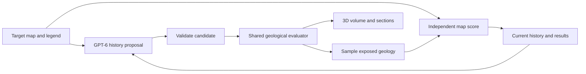

# Farallon: geological history inference demo

The strongest five-hour version is an interactive geological hypothesis test: a target map remains fixed while GPT-6 proposes an executable history, a small procedural engine generates its three-dimensional consequences, and independent measurements show which changes improve the exposed geology. The memorable moment is a structural revision, such as adding a fault because several contacts are displaced across the same line, followed by a visible improvement in the map and a consistent change in the corresponding cross-section. Without an observed section, the section illustrates the hypothesis rather than independently validating it.

This memo recommends a modest constructive event simulator, an explicit labeled volume, a shared surface/section evaluator, and a short visual reasoning loop. Secure a controlled synthetic target with a hidden generating history first; promote a prepared real-map crop to the main demonstration if its terrain and geological complexity fit the engine. Keep a full relational reasoning system and arbitrary new numerical operators outside the initial critical path.

The architecture and time allocations below are proposed engineering choices, not measured performance or demonstrated inversion results. No simulator, application, or model-call benchmark has been implemented. The open decisions are the target map, the meaning of explicit geometry, where live code generation should appear, and the demo machine/API access.

**The scientific claim**

The central problem is inference over both history structure and numerical parameters. A history has an ordered list of event types and parameters: which formations were deposited, which deformation happened, whether a fault exists, when an intrusion occurred, and how erosion exposes the resulting bodies. Changing a fault displacement is parameter fitting; inserting a previously absent fault or moving it earlier in the sequence changes the hypothesis itself.

The proposed objective can be written conceptually as minimizing a map discrepancy plus a preference for simpler histories, subject to basic validity constraints. The target is the present-day exposure of a three-dimensional history, not the history directly. This is an underdetermined inverse problem: a successful surface match supports a plausible explanation without establishing a unique subsurface or a unique sequence of events.

Classical methods can explore discrete hypotheses too. The useful claim is that visual and geological knowledge may help a language model propose informative changes efficiently. Establishing superiority to conventional search would require controlled comparisons under comparable budgets. A three-minute demonstration can show evidence-driven proposals, valid execution, and measured improvement without making that broader claim.

There are precedents on both sides. Noddy/pynoddy describes chronological kinematic events and evaluation of points through inverse displacements in reverse order.[^1] VIGA studies an iterative code-render-inspect loop with visual-language models.[^2] Thinking in Blender studies staged executable scene reconstruction and identifies repeated inference cost and early-stage errors as limitations.[^3] These works support the architecture as a research direction; they do not establish GPT-6 geological accuracy or a half-second end-to-end runtime.

**A concrete demonstration**

Begin with a map containing four to six distinguishable formations and one dominant structural story. The initial history should be an explicitly simple baseline: a deposited stack with a rough tilt or fold. Show its map and section, identify the largest disagreement, then let GPT-6 propose a new history. A small numerical search can refine the coordinates and displacement of the proposed event before the best candidate is displayed.

An illustrative sequence is deposition, folding, intrusion, faulting, and erosion. The first useful proposal improves the broad pattern; the next explains displaced contacts with a fault; a later proposal changes the timing or geometry of the intrusion. This is an example of a legible story, not a prescribed response sequence. If the model finds a good explanation immediately, show that result rather than forcing extra iterations.

The most valuable initial interaction is an event toggle under fixed present-day terrain. Turning off the inferred fault should remove the offset in both the surface prediction and the section. Moving an intrusion from before to after the fault should change whether it is displaced. These counterfactuals make event semantics visible and demonstrate that the model is more than a painted surface. A true geological time slider would also need historical terrain/exposure semantics; reserve that for later.

| Presentation time | Visible action | Purpose |
| --- | --- | --- |
| 0:00–0:20 | Target map, legend, simple baseline, initial fit | Establish the evidence and the task |
| 0:20–0:55 | First live hypothesis and regenerated geology | Show image-to-history reasoning |
| 0:55–1:30 | Structural revision, highlighted event diff, measured fit | Show a new explanatory event |
| 1:30–2:05 | Further revision or comparison of alternatives | Show learning from generated evidence |
| 2:05–2:40 | Orbit block, move section, toggle an event | Demonstrate the inferred 3D consequences |
| 2:40–3:00 | Final comparison and remaining uncertainty | State what the result explains |

Those timings require model calls that fit roughly 35-second rounds. They are presentation allocations, not predictions of GPT-6 latency. Rehearsal must determine the number of live rounds. A saved, visibly labeled replay of an actual run is a useful backup; it should never be presented as a live result.

**The procedural engine**

Use a persistent Python process with NumPy and a small Numba kernel. A typed history is the source of truth. The kernel answers one question: which material occupies a requested three-dimensional location after this history? The explicit volume, observed map, block faces, and movable sections all derive from that same answer.

There are three meanings of “explicit” to distinguish. The geological events and their order can be explicit. The final geometry can be explicit voxels or meshes. The analytic point-membership tests used to evaluate those events may still be described mathematically as implicit surfaces. This recommendation avoids GemPy-style geological interpolation but uses analytic membership tests and coordinate transformations, then materializes an explicit categorical volume. If fully maintained boundary meshes are required at every event, the plan needs a different risk and time budget. Blockworlds explicitly discusses this distinction for parametric kinematic models.[^4]

Store the history in chronological order for readability. Evaluate a point backward through the history: undo later deformation, test whether the point belongs to a younger created body, and stop once material ownership is determined. Erosion removes older material; later deposits can occupy the space above the resulting unconformity. An intrusion must replace pre-existing host rock; constrain its event-time extent or check host occupancy so an ellipsoid does not create intrusive rock in air. This preserves the difference between a fault that displaces an intrusion and an intrusion that cuts already faulted rocks.

Avoid repeatedly moving and resampling a labeled voxel grid through events. That approach accumulates sampling artifacts and makes gaps, overlaps, and material ownership difficult to handle. Sampling the constructive history at final query locations preserves one consistent definition at different resolutions. Final voxel and pixel aliasing still exists; very thin units can disappear.

| Event | Initial form | Geological scope and limitation |
| --- | --- | --- |
| Stratigraphic stack | Stable formation IDs, positive thicknesses, basal elevation | Depositional packages with a known order |
| Tilt | Rigid rotation around a pivot | Simple regional orientation |
| Fold | Sinusoidal vertical displacement in a local frame | Open folds; a kinematic approximation, not a mechanical folding model |
| Fault | Infinite plane with a translation tangent to the plane | One clear offset; finite fault tips and complex drag are deferred |
| Intrusion | Rotated ellipsoid or slab replacing older host material | Simple stock or dike; no mechanical emplacement simulation |
| Erosion | Truncation by a plane or prescribed terrain | Exposure; a younger package is needed for an unconformity sequence |

For the first working loop, implement the stack, tilt/fold, one planar fault, and final erosion. Add an intrusion only if the chosen story benefits from it. A second sedimentary package over an erosional surface is an alternative stretch; building every event type is less valuable than making one target understandable.

Two mathematical details deserve early attention. A fold of the form z' = z + A sin(ku + phase), with horizontal u, has an exact inverse by subtraction; arbitrary depth-dependent displacement does not. For a planar fault, constrain displacement s to the plane, so n·s = 0 for normal n. Then the displaced side remains identifiable during inversion. Pure vertical translation across a dipping fault generally does not satisfy that condition. Define dip, strike, slip, throw, and coordinate conventions once.

Chronology, finite parameters, positive thicknesses/radii/wavelengths, material references, event-count limits, and supported operators should be checked deterministically. Preserve event provenance where practical: identical rock types on both sides of a fault can conceal its discontinuity in a lithology-only grid. A fault-plane overlay or small provenance code can retain that information.

**The half-second requirement**

For P samples and E bounded constant-cost events, evaluation is approximately O(P × E). This is a work count rather than a runtime estimate. A fused point loop can keep coordinates local and avoid allocating several large temporary arrays per event.

| Output | Samples | Maximum point-event visits at eight events | Label storage at one byte/sample |
| --- | ---: | ---: | ---: |
| 128 × 128 search map | 16,384 | 131,072 | 16 KiB |
| 256 × 256 display/scoring map | 65,536 | 524,288 | 64 KiB |
| 512 × 512 map | 262,144 | 2,097,152 | 256 KiB |
| 96³ volume | 884,736 | 7,077,888 | 864 KiB |
| 128³ volume | 2,097,152 | 16,777,216 | 2 MiB |

Start with a 256² map and 96³ volume, with a 128² surface-only mode for candidate searches. Sixty-four such small map evaluations involve about 8.4 million point-event visits at eight events, comparable in order of magnitude to one 96³ volume. The two operations need not have identical cost, but this explains why many useful candidate tests may fit between language-model calls.

Numba documents first-call compilation and reuse for previously compiled argument types; it also supports native numerical loops and parallel point work.[^5][^6] Keep the compiled interpreter stable, passing numeric event codes and parameter arrays. Adding an instance of a known event should change data, not require compilation of a newly generated kernel. Changing the mathematical implementation of an operator is a different operation and may incur compilation latency.

The first implementation milestone should measure cold startup/JIT, warm map generation, warm full-volume generation, scoring, transfer, and visible browser update separately. Require repeated warm trials and report at least median and p95. A 100 ms geometry calculation followed by slow encoding is not a responsive 100 ms demo.

| Component | Proposed warm budget, to be tested |
| --- | ---: |
| Parse/validate/pack history | 5–10 ms |
| Generate 96³ categorical volume | 200–300 ms |
| Evaluate 256² exposure | 15–40 ms |
| Compute map metrics | 5–20 ms |
| Transfer textures and display next frame | 20–80 ms |
| Total allocation | 245–450 ms |

These numbers allocate the desired 500 ms envelope; they are not benchmark results or guarantees. If the full-volume path exceeds the budget, reduce resolution and remeasure. A surface-and-sections preview can remain responsive while an accepted volume finishes, but that should be described accurately rather than counted as sub-half-second full-volume generation.

The local default Python reports 3.14.6 and does not currently have NumPy, Numba, or SciPy installed. No dependencies were installed during research. Numba's current compatibility table includes Python 3.14, so an appropriate pinned environment is feasible in principle; wheel availability on the actual machine still needs checking.[^7]

**Observation and visual presentation**

With known terrain T(x,y), the exposed unit is L(x,y,T(x,y)−epsilon), using a consistent vertical convention. It is not necessarily the youngest unit. If the volume contains air at that location, count that as an exposure/coverage error. Keep the observed terrain fixed; selecting a different depth would change the observation being fitted.

A real geological map is a mapped interpretation assembled from observations and inference. It may include concealed contacts, alluvium, soil, uncertain boundaries, and generalization at map scale. The relevant comparison is therefore the model's mapped exposure against the chosen map units and observation mask. Ground samples, if available, should be separate constraints.

Use an orbitable block with the predicted map on its actual upper surface, geological sections on its sides, and a movable section plane. Texture updates are sufficient for much of this display; full watertight meshing of every formation is unnecessary for the first demonstration. Three.js supports textures directly from numerical buffers, and its voxel guidance explains the cost of unnecessary cube faces.[^8][^9] Keep material IDs categorical, with stable palette lookup and consistent north/up orientation.

The main view should show target map, prediction, and their disagreements at the same scale and orientation. The 3D block and history timeline explain the cause of those patterns. Show a short evidence statement, the changed event, whether the candidate was accepted, and the measured fit. Raw logs, API settings, and implementation plumbing belong outside the presentation view.

**How the inference loop should work**

Give GPT-6 the clean target with legend, the aligned prediction, a labeled disagreement image, the current history, and a compact record of recent attempts. Include the original map crop when interpreting symbols and contacts; numerical scoring should use prepared categorical data. Fix the coordinate frame, extent, palette, observation mask, and terrain across iterations. If explicit fault symbols are visible, describe the capability as reading and integrating mapped structures. A claim of inferring an unmarked fault from displaced bands requires withholding that overlay and keeping it available separately for evaluation.

Ask for one concise observation, one proposed structural edit, an initial parameter guess or range, and the expected visible consequence. A useful proposal looks like: “Three contacts end against the same diagonal boundary and resume displaced to the east; insert a fault after folding.” That is an evidence-linked hypothesis, not an assertion that the fault is proven.

The controller validates and evaluates the proposal. A small bounded search refines a few nominated parameters, such as fault position, strike, and slip. Preserve the best history, and allow a second branch when ordering or event type is ambiguous. Return the numerical result and changed image to the next model call. Keep a small rejected-proposal record to discourage repeated unsuccessful edits.

This separates expensive semantic decisions from inexpensive numerical trial. It also prevents the language model's own confidence from becoming the measurement of success. For three-minute latency, combine observation, hypothesis, and history edit in one model call per round where possible. Official OpenAI guidance supports reducing sequential requests, concise output, and streaming for responsiveness.[^10]

GPT-6 Astra's current model documentation lists image input, function calling, structured output, and streaming.[^11] That supports a structured proposal interface, but it does not establish account access, hackathon endpoint behavior, or latency. Structured output still requires semantic validation.[^12] No paid API calls were made during this research.

Set a small evaluation and wall-time budget for numerical refinement. A straightforward bounded perturbation or coordinate search is enough initially. Differential evolution is an available derivative-free option, but SciPy documents that it can require many evaluations; its defaults are excessive for this presentation.[^13] Candidate steps must exceed the current raster's effective resolution when the loss is flat. Reevaluate finalists on the fixed display grid so coarse-grid gains do not become misleading accepted improvements.

**What to measure**

The headline measure should be macro intersection-over-union across the evaluated geological classes. Compute each class's intersection divided by its union, then average. Use a fixed semantic label dictionary and include classes present in either prediction or target; do not reward an absent class with a perfect score. Keep an explicit mask for genuinely unobserved or excluded regions.

Complement it with a boundary measure. A symmetric mean distance between corresponding formation boundaries is intuitive in pixels or map units; a boundary F1 within a fixed tolerance is another useful display. Fix the contact-pair aggregation: if both sides have no boundary for a pair, assign zero error; if only one side has a boundary, assign a fixed finite penalty. A disappearing predicted contact must not disappear from the denominator. Exclude crop edges and no-data borders from geological contacts. Match boundaries by formation identity or contact pair where feasible; an unlabeled edge score can reward the wrong geological contact in the right place. Boundary IoU research motivates contact-sensitive evaluation alongside region overlap, but does not validate this particular geological loss.[^31]

A lightweight structural diagnostic can compare exposed-unit adjacency, connected components, or the presence of an observed fault trace. Schaaf et al. use geological topology graphs to constrain model ensembles, supporting topology as an additional source of information.[^14] A map graph is only an exposure graph: absent adjacency at the surface does not imply no underground contact, and a repeated formation label need not denote one connected body.

For the core, display map IoU and boundary error, and prefer simpler histories when fit is similar. If a combined ranking is needed, normalize and fix its weights before the demonstration, document them, and continue to display the underlying metrics. Schema/geometry failures should reject candidates. Uncertain geological interpretations should remain soft evidence. RGB screenshot similarity and a single subjective “looks better” score are poor primary objectives for categorical geology.

Blockworlds demonstrates how discretization can distort geological inversion landscapes.[^4] Its geophysical anti-aliasing method should not be copied directly into categorical labels. The practical lesson here is to inspect resolution sensitivity, use boundary-aware comparisons, and avoid treating one-pixel changes as strong geological evidence.

**Code generation and Lemmalog**

There are three distinct demonstrations available. Editing JSON histories shows structured hypothesis generation. Writing executable histories over a fixed event library shows program synthesis in a geological language. Authoring a new numerical event implementation shows a stronger, more open-ended code-generation capability. The presentation should say which one actually occurs.

The lowest-risk core recommendation is that GPT-6 emits a typed JSON history patch and the interface displays the actual configuration diff. That demonstrates visual reasoning and configuration synthesis. A pretty-printed program view would not change what was generated. If live code generation is essential, choose explicitly between having GPT-6 author an executable history in a small DSL, or reserving a stretch feature in which it writes one new deformation function. The former stays within existing operator semantics; the latter changes the numerical library. A height displacement depending only on horizontal coordinates offers a narrow, analytically invertible interface for that extension. Validate shape, finiteness, inverse consistency, diagnostic behavior, and runtime before using it. Count code generation and compilation separately from warm simulation.

Lemmalog is a Rust Datalog engine for agent memory, with provenance, retractions, rule installation, and hypothetical queries.[^15] Its author's motivation is maintaining consequences as evidence changes; its extraction boundary still depends on the LLM.[^16] This is a useful future architecture for combining maps, reports, and revised interpretations.

The conceptual distinction is deduction versus hypothesis generation. Datalog derives consequences from supplied rules and facts. It does not, by itself, invent the fault geometry that explains an image. Its what-if query can test the consequences of a supplied event-order assumption; the language model must still propose it and the geological engine must still produce and score the geometry.

For a history with a few events, a small chronology graph and explicit evidence records provide the necessary behavior with less integration work. Do not put every pixel or voxel into the rule database. If Lemmalog is included later, use it for statements such as which observation supports an event order, which deductions depend on a disputed map interpretation, and what becomes invalid after retracting that interpretation. Its rule-authoring example provides a concrete later code-generation pattern.[^17]

Maintain three distinctions: an observation versus an interpretation, the age of geological events versus the date an interpretation changes, and missing evidence versus evidence of absence. Negation-as-absence in a logic engine must not turn an unmarked fault into proof that no fault exists.

**The 2025 paper and DE-9IM**

Parquer et al. describe a consistency checker combining spatial, temporal, and polarity relations between geological objects. Their prototype is a validator of model reasonableness, not a fast simulator or an inverse-history solver. Its boundary-representation workflow takes minutes per model; reproducing it is inappropriate for the critical path.[^18]

The useful adaptation is a small set of explicit constraints and evidence explanations. For example, an intrusion cutting a formation must be younger than that host under the assumed interpretation; a younger package sealing a fault constrains its timing. A present-day “young above old” check is not universal because valid deformation can reverse apparent order. Passing a few rules establishes only those checks, not full geological validity.

DE-9IM is useful vocabulary for spatial relations. Shapely provides these predicates for planar geometries and ignores Z in geometric analysis.[^19] It can help with a prepared surface map, but it does not supply a three-dimensional geological consistency engine. Geometry also does not establish time by itself: intersection or enclosure needs geological interpretation before it becomes a chronology constraint.

**What to reuse from geo-lm**

The inspected repository revision is e3907b3aab22501d301f33f54161f4ad4c23c238. Its grammar implements rock, deposition, erosion, and intrusion statements; fault and fold are listed as extensions.[^20] The validator already checks references, duplicate IDs, chronology cycles, and inconsistent age/dependency constraints.[^21] Those are good ideas to preserve.

The geometric path is a different fit for this project. The spatial generator samples noisy tilted planes, while the transformer does not transfer intrusion style into the surface geometry configuration.[^22][^23] The current workflow does not set the generator's optional seed, and the builder writes CSV inputs and computes a GemPy dense grid.[^24][^25] These are source observations, not measured runtime defects. Replace that path with the small constructive evaluator to give event edits direct, reproducible geometric consequences.

The React Three Fiber viewer has reusable orbit controls, indexed geometry, legends, and a geological Z-up to Three.js Y-up transformation.[^26] Reuse patterns selectively; stabilize material colors by lithology ID so adding or reordering an event does not alter comparison semantics.

**Target choice and data preparation**

A synthetic target should hide its generating history from the inference process and use a nontrivial starting mismatch. A held-out parameter draw demonstrates inference within the event family. Because the generator and reconstructor share that family, it is not evidence of unrestricted real-world reconstruction. A separate real-map target tests different difficulties: uncertain contacts, terrain, cover, and geological behavior outside the primitive set.

The strongest visually inspected real-map candidate is the northwest fold closure in the Sheep Mountain–Little Sheep Mountain map, Wyoming. Nested bands and contrasting limb widths give a clear fold-reconstruction story. The inspected source sheet is monochrome and contains thin formations, terrain contours, and surficial deposits, so a colored target should come from the digital unit polygons rather than automatic color segmentation of that sheet.[^28] A simple fault-offset or intrusion story has not been established for this candidate.

NPS includes this source in the Bighorn Canyon geological dataset, with a downloadable GeoPackage and QGIS project.[^30] The combined package specifies a 1:250,000 scale-use limitation and a 127 m horizontal accuracy scale, despite the Rioux source sheet being finer. It has no elevation data. Treat the crop as a generalized illustrative interpretation, retain NPS/USGS source credit, and do not infer finer precision from the source sheet alone. The catalog does not supply a blanket CC0 license. Original USGS-authored publications have a separate reuse policy.[^32]

Capitol Reef remains a useful alternative data source: NPS provides digital units, structural features, a GeoPackage, and supporting documentation.[^27] However, the visually inspected USGS headquarters-area sheet is a poor main target for discovering a missing fault. Its pattern is dominated by canyon exposure and surficial cover, with a small fault at the map margin.[^29] The larger Waterpocket Fold/Teasdale area has not yet yielded a verified simple crop in this research. These are map-selection judgments from the inspected sheets, not claims that the regions lack other structures.

| Target | Best use | Preparation and remaining uncertainty |
| --- | --- | --- |
| Controlled synthetic folded/faulted stack | Reliable main loop and known hidden history | Separate target-generation state from inference; validate held-out parameters |
| Sheep Mountain fold closure | Strongest real-map fold candidate | Extract polygons; aggregate contiguous stratigraphic groups; account for relief and cover |
| Capitol Reef regional data | Alternative real-map exploration | Find a suitable crop; regional geology is more complex than the initial operators |
| Capitol Reef headquarters sheet | Reference for exposure/topography discussion | Rejected as the principal missing-fault example |

Prepare one crop once. Keep unit polygons, a stable legend mapping, map extent/projection, uncertainty/cover mask, and terrain if required. Convert coordinates to a small local Cartesian frame for the engine, retaining the transform to map units. Group formations only when the grouping is defensible and displayed; never merge classes simply to improve a score. If cover is excluded, state that the target is mapped bedrock exposure and display the evaluated area fraction. For raster-only targets, review segmentation and mask text/symbols rather than allowing them to count as geological errors.

The first data gate is representability: can the selected crop be approximated by the planned operators with readable results? A low-dimensional history cannot reproduce arbitrary polygon boundaries. If a real crop needs complex fault networks, multiple folding phases, metamorphic zones, or detailed erosion, choose another crop or use it as a clearly labeled exploratory example.

**Five-hour envelope**

| Elapsed allocation | Work and deliverable | Decision gate |
| --- | --- | --- |
| 0:00–0:25 | Research, target choice, explicit-geometry and code-generation decisions | Agree on one main story |
| 0:25–1:25 | Engine and event contract; frontend shell in parallel; prepare target and verify model access | Deterministic map/section; warm benchmark; measured API latency |
| 1:25–2:25 | Scoring, one live structured proposal, bounded local refinement, iteration record | One complete image-to-history-to-score loop |
| 2:25–3:15 | Structural revision quality, accepted/rejected candidates, selected extra event | Useful improvement from a new hypothesis |
| 3:15–4:00 | 3D section interaction, readable evidence, event diff, presentation layout | Coherent three-minute story |
| 4:00–4:35 | Repeated full rehearsals, inspect failures, capture a real fallback run | Reliable live round count |
| 4:35–5:00 | Buffer and targeted fixes | Freeze working demo |

The research allocation is part of the five-hour envelope, not an extra five hours of implementation. Parallel roles can own the numerical engine, viewer, and target/scoring while one coordinator integrates the model loop. Agree on event schema, axis conventions, material IDs, and transport format before those branches proceed.

If the warm volume target fails, reduce resolution before expanding the operator library. If the real crop cannot be made legible early, retain the controlled target and use the real map as exploration. If model calls are too slow for three rounds, present fewer substantive live rounds and give more time to the geometric consequences. If a new operator is unreliable, keep it out of the primary run.

The minimum finished demo has one target, a genuine 3D history evaluator, a visible structural proposal, independent before/after measurements, an inspectable section, and a recoverable best candidate. A full Datalog integration, geophysics, mechanical simulation, watertight formation meshes, arbitrary map ingestion, and universal geological inversion should wait.

**Validation that earns its time**

Test deterministic reproduction; a known fault displacing older beds; an intrusion before versus after that fault; fold forward/inverse consistency; and agreement between volume samples, map samples, and sections within the declared discretization. Check metric behavior on identical labels, a shifted contact, a missing class, and masked no-data. These catch errors that could make the demonstration persuasive but wrong.

Measure complete rehearsals across several starting histories. Record model-call time, candidate evaluations, map IoU, boundary error, accepted event changes, and failures. A parameter-only comparison from the same starting history can illustrate the benefit of changing the event vocabulary, but it cannot establish superiority over all conventional algorithms. If broader claims matter, add a later same-budget search baseline that can also insert, delete, and reorder events.

**Sources**

[^1]: Wellmann et al. (2016), [pynoddy 1.0: an experimental platform for automated 3-D kinematic and potential field modelling](https://gmd.copernicus.org/articles/9/1019/2016/), Geoscientific Model Development. Algorithmic precedent, not the proposed runtime benchmark.
[^2]: Yin et al. (2026), [Vision-as-Inverse-Graphics Agent via Interleaved Multimodal Reasoning](https://arxiv.org/html/2601.11109v3), arXiv v3, 6 April. Visual program-refinement precedent; not geological validation.
[^3]: He et al. (2026), [Thinking in Blender: Staged Executable Inverse Graphics with Vision-Language Models](https://arxiv.org/html/2606.02580v1), arXiv, 1 June. Staged reconstruction and limitations.
[^4]: Scalzo et al. (2022), [Blockworlds 0.1.0: a demonstration of anti-aliased geophysics for probabilistic inversions of implicit and kinematic geological models](https://gmd.copernicus.org/articles/15/3641/2022/gmd-15-3641-2022.html), Geoscientific Model Development. Kinematic formulation, implicit terminology, discretization limitations.
[^5]: Numba documentation, [A ~5 minute guide to Numba](https://numba.readthedocs.io/en/stable/user/5minguide.html), accessed 8 September 2026. Compilation and warm measurement.
[^6]: Numba documentation, [Performance Tips](https://numba.readthedocs.io/en/stable/user/performance-tips.html), accessed 8 September 2026. Native loops and parallelism; example timings are not forecasts for this task.
[^7]: Numba documentation, [Installation: version support information](https://numba.readthedocs.io/en/stable/user/installing.html#version-support-information), accessed 8 September 2026.
[^8]: Three.js documentation, [DataTexture](https://threejs.org/docs/pages/DataTexture.html), accessed 8 September 2026.
[^9]: Three.js manual, [Voxel Geometry](https://threejs.org/manual/en/voxel-geometry.html), accessed 8 September 2026.
[^10]: OpenAI, [Latency optimization](https://developers.openai.com/api/docs/guides/latency-optimization), accessed 8 September 2026.
[^11]: OpenAI, [GPT-6 Astra model](https://developers.openai.com/api/docs/models/gpt-6-astra), accessed 8 September 2026. Feature support is distinct from account-specific access and latency.
[^12]: OpenAI, [Structured model outputs](https://developers.openai.com/api/docs/guides/structured-outputs), accessed 8 September 2026. Schema adherence does not establish semantic correctness.
[^13]: SciPy, [differential_evolution](https://docs.scipy.org/doc/scipy/reference/generated/scipy.optimize.differential_evolution.html), accessed 8 September 2026.
[^14]: Schaaf et al. (2021), [Constraining stochastic 3-D structural geological models with topology information using approximate Bayesian computation in GemPy 2.1](https://gmd.copernicus.org/articles/14/3899/2021/), Geoscientific Model Development.
[^15]: Jordy Zomer, [Lemmalog](https://github.com/JordyZomer/lemmalog/tree/74d428a2497066795f6328946457f22d713fcbd5), repository revision inspected 8 September 2026. Features and author-reported measurements are not independent geology benchmarks.
[^16]: Jordy Zomer, [I accidentally turned LLM memory into program analysis](https://pwning.systems/posts/llm-memory-program-analysis/), accessed 8 September 2026. The linked [Hacker News discussion](https://news.ycombinator.com/item?id=49485416) was also reviewed as commentary, not technical validation.
[^17]: Lemmalog, [LLM rule-authoring example](https://github.com/JordyZomer/lemmalog/blob/74d428a2497066795f6328946457f22d713fcbd5/examples/llm_rules.rs).
[^18]: Parquer, de Kemp, Brodaric, and Hillier (2025), [Checking the consistency of 3D geological models](https://gmd.copernicus.org/articles/18/71/2025/), Geoscientific Model Development 18, 71–100. Local supplied copy: papers/gmd-18-71-2025.pdf. Relevant sections: 2, 3, and 5.
[^19]: Shapely documentation, [The Shapely User Manual](https://shapely.readthedocs.io/en/stable/manual.html), accessed 8 September 2026. Planar geometry and DE-9IM implementation. The supplied [DE-9IM overview](https://en.wikipedia.org/wiki/DE-9IM) was read for context; technical recommendations rely on primary documentation and the geological papers.
[^20]: William J. S. Davis, geo-lm, [grammar.lark](https://github.com/williamjsdavis/geo-lm/blob/e3907b3aab22501d301f33f54161f4ad4c23c238/geo_lm/parsers/dsl/grammar.lark).
[^21]: geo-lm, [validator.py](https://github.com/williamjsdavis/geo-lm/blob/e3907b3aab22501d301f33f54161f4ad4c23c238/geo_lm/parsers/dsl/validator.py).
[^22]: geo-lm, [spatial.py](https://github.com/williamjsdavis/geo-lm/blob/e3907b3aab22501d301f33f54161f4ad4c23c238/geo_lm/gempy/spatial.py).
[^23]: geo-lm, [transformer.py](https://github.com/williamjsdavis/geo-lm/blob/e3907b3aab22501d301f33f54161f4ad4c23c238/geo_lm/gempy/transformer.py).
[^24]: geo-lm, [model.py](https://github.com/williamjsdavis/geo-lm/blob/e3907b3aab22501d301f33f54161f4ad4c23c238/geo_lm/graphs/model.py).
[^25]: geo-lm, [builder.py](https://github.com/williamjsdavis/geo-lm/blob/e3907b3aab22501d301f33f54161f4ad4c23c238/geo_lm/gempy/builder.py).
[^26]: geo-lm, [ModelViewer.tsx](https://github.com/williamjsdavis/geo-lm/blob/e3907b3aab22501d301f33f54161f4ad4c23c238/web/src/components/ModelViewer.tsx).
[^27]: National Park Service, [Digital Geologic-GIS Map of Capitol Reef National Park and Vicinity, Utah](https://catalog.data.gov/dataset/digital-geologic-gis-map-of-capitol-reef-national-park-and-vicinity-utah-nps-grd-gri--1987), dataset inventory accessed 8 September 2026. Candidate data source; an exact demo crop remains to be selected.
[^28]: Rioux (1994), [Geologic map of the Sheep Mountain–Little Sheep Mountain area, Big Horn County, Wyoming](https://pubs.usgs.gov/publication/ofr94191), USGS Open-File Report 94-191. [Preview map sheet inspected](https://pubs.usgs.gov/of/1994/0191/plate-1-preview.pdf).
[^29]: USGS, [Capitol Reef headquarters-area map, Water-Supply Paper 1475-G, plate 1](https://pubs.usgs.gov/wsp/1475g/plate-1.pdf). Full sheet visually inspected for target suitability.
[^30]: National Park Service, [Digital Geologic-GIS Maps of Bighorn Canyon National Recreation Area](https://catalog.data.gov/dataset/digital-geologic-gis-maps-of-bighorn-canyon-national-recreation-area-montana-and-wyom-2007), accessed 8 September 2026. [GeoPackage ZIP](https://irma.nps.gov/DataStore/DownloadFile/692084?Reference=2300780); [metadata](https://irma.nps.gov/DataStore/DownloadFile/692085?Reference=2300780), pp. 8–10 for access/use constraints. Dataset includes the Rioux source among other maps.
[^31]: Cheng et al. (2021), [Boundary IoU: Improving Object-Centric Image Segmentation Evaluation](https://arxiv.org/abs/2103.16562). Motivation for complementing region overlap with boundary-sensitive evaluation.
[^32]: USGS, [Are USGS reports/publications copyrighted?](https://www.usgs.gov/faqs/are-usgs-reportspublications-copyrighted), accessed 8 September 2026. Applies to USGS-authored material; separately credited third-party content may differ.
